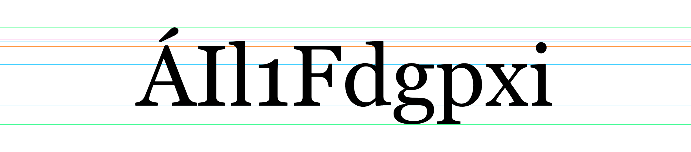

# 📏 Typometry

**A tiny JavaScript module to get typographic measures.** [DEMO 😎](https://giuscris.github.io/typometry)



## Usage

Getting typographic measures about a typeface is as easy as importing and calling `measureFont()`:

```js
import { measureFont } from './typometry.js';

const metrics = measureFont({
    fontFamily: 'Georgia',
    fontStyle: 'normal',
    fontWeight: 400,
    fontSize: 1000
});
```
📌 The `fontSize` property is used internally to do the measurements. Larger values will take more time, but results will be more accurate.

This will return an object like this:

```js
{
    baseline: 0,
    ascent: 0.755,
    descent: -0.217,
    xHeight: 0.481,
    capHeight: 0.692,
    figHeight: 0.539,
    tittleHeight: 0.739,
    roundOvershoot: 0.71,
    pointedOvershoot: 0.703,
    emTop: 0.778,
    emBottom: -0.222,
    emMiddle: 0.278,
    emHeight: 1,
    bboxTop: 0.917,
    bboxBottom: -0.219,
    bboxHeight: 1.136,
    lineHeight: 1.136
}
```

📌 Note that all values are independent from the `fontSize` of `1000`. Indeed, they are divided by that size, so they have to be multiplied to get actual values.

Using the previous above (measures for the Georgia typeface), if you want to get the x-height for `18px` type you can write something like this:

```js
const fontSize = 18;
const actualXHeight = metrics.xHeight * fontSize; // 8.658px
```

## Available measures

1. **baseline:** the line on which the text is placed (always `0`).
2. **ascent:** the distance of ascenders (letter `d` is used for reference).
3. **descent:** the distance of descenders (letter `p` is used for reference).
4. **xHeight:** the height lowercase letters (`x` is used for reference).
5. **capHeight:** the height of capital letters (`H` is used for reference).
6. **figHeight:** the height of figures (`1`, digit one, is used for reference).
7. **tittleHeight:** the height of the dot above `i`.
8. **roundOvershoot:** the [overshoot](https://en.wikipedia.org/wiki/Overshoot_(typography)) height of round capital letters like `O`.
9. **pointedOvershoot:** the [overshoot](https://en.wikipedia.org/wiki/Overshoot_(typography)) height of pointed capital letters like `A`.
10. **emTop:** the top of the em square.
11. **emBottom:** the bottom of the em square.
12. **emMiddle:** the middle of the em square (is useful to center text vertically).
13. **emHeight:** the height of em square (same as `emTop - emBottom`, should be `1`).
14. **bboxTop:** the position of the bounding box top, i.e. the highest vertical extension of the font (only available on recent browsers, see [Can I Use](https://caniuse.com/mdn-api_textmetrics_fontboundingboxascent)).
15. **bboxTop:** the position of the bounding box top, i.e. the lowest vertical extension of the font (only available on recent browsers, see [Can I Use](https://caniuse.com/mdn-api_textmetrics_fontboundingboxdescent)).
16. **bboxHeight:** the height of bounding box (same as `bboxTop - bboxBottom`).
17. **lineHeight:** line height assigned by the browser (as with the CSS declaration `line-height: normal;`), should be equal to `bboxHeight`.

📌 All distances are computed from the baseline so that positive measures are above the line, and the negative below.